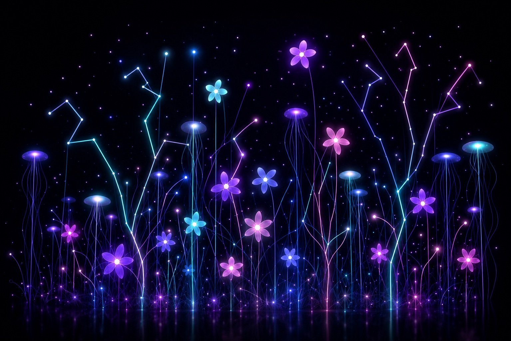
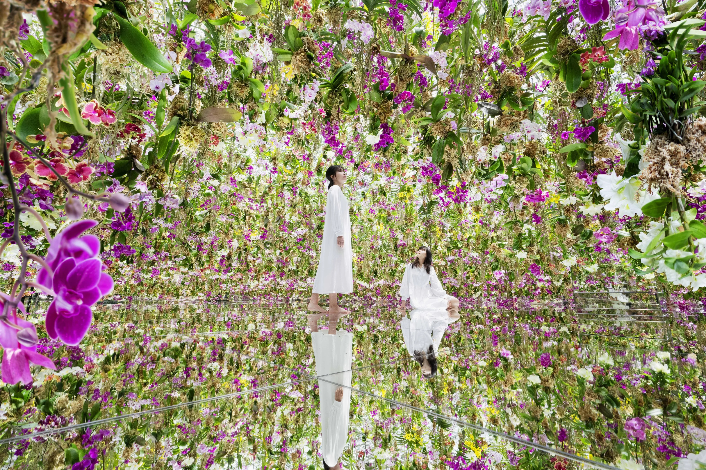
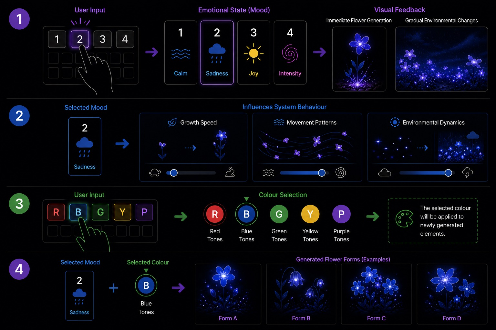

# Team-4_9103_tut1
xche0262/fali0101/wjia0677
IDEA9103 – Quiz 9

## Cat Chase Field

### Part 1: Project Direction

Our team has chosen Option 2: Create an original piece.
This project is an original interactive visual artwork designed to attract pets’ attention, especially cats.

1. Project Vision 

Our project is called Cat Chase Field. It is an abstract interactive animation inspired by cats’ hunting instincts and playful behaviour. Instead of using realistic animals or toys, we use glowing dots, moving lines, geometric bugs, ripple effects, and dark backgrounds to create a playful “moving prey field.” Small objects suddenly appear, escape, drift, or shake slightly to attract curiosity and attention.

The project focuses on movement, unpredictability, and interaction rather than storytelling. Inspired by laser pointers, strings, insects, and glowing particles, the experience becomes a constantly changing playground for cats. Through simple shapes and responsive motion, we aim to create an engaging visual environment that feels alive, playful, and interactive.

2. Inspiration Sources

- Laser Pointer Movement

Cats naturally chase fast-moving red laser dots because of their hunting instinct.
We use this idea to design glowing moving targets and sudden direction changes.

- String and Ribbon Toys

Soft swinging movement attracts cats’ attention more effectively than static objects.
This inspired the “String Snake” mechanic with delayed movement and flexible motion.

- Glow Bugs and Small Insects

Cats are highly sensitive to tiny unpredictable movements.
We use floating glowing bugs and drifting motion to recreate this behaviour.

3. Suggested Reference Images

### Part 2: Mechanics

Team Members and Mechanics:

- Member xche0262 :	Time-based 	
- Member wjia0677 :	Perlin Noise & Randomness 
- Member fali0101 :	User Input 

1. Mechanic 1: Time-based

This mechanic uses timers and events to control hidden “prey” appearing and disappearing from holes on the screen. Several dark circular holes are placed around the canvas, surrounded by soft glowing rings. Every 3–5 seconds, one randomly selected hole activates and a small glowing object briefly peeks out before hiding again. Over time, the appearance speed gradually increases, creating stronger tension and excitement.

This mechanic supports our concept because cats are naturally attracted to sudden movement and short-lived targets. By combining scaling animations, glowing circles, and timed appearances, the artwork feels alive and constantly changing even without direct interaction. The timing system creates anticipation and surprise, making the screen behave like a playful hunting field rather than a static animation.

2. Mechanic 2: Perlin Noise and Randomness

This mechanic controls floating glowing bugs using Perlin noise and random values. The bugs are created from simple geometric shapes such as ellipses, circles, transparent wings, and thin antenna lines. Perlin noise generates smooth and natural movement so the bugs drift softly across the screen instead of moving in sharp or robotic directions.

Random values control the bugs’ starting positions, colours, sizes, speeds, and occasional sudden turns. This makes every run of the artwork slightly different and prevents the movement from becoming repetitive. The mechanic connects strongly to the idea of “escaping prey,” because cats are highly sensitive to tiny unpredictable movements. Together, Perlin noise and randomness create a playful and organic visual environment that continuously attracts attention.

3. Mechanic 3: User Input

This mechanic allows users to interact with the artwork using mouse movement and clicks. A flexible “String Snake” follows the cursor using connected circles and thin lines. The head follows the mouse directly while the rest of the body follows with delay, creating a soft swinging movement similar to a cat teaser toy.

When users click, a “Paw Ripple” effect appears. Circular ripples expand outward while small glowing circles form a simplified paw-print shape before fading away. This interaction transforms the user into an active participant, similar to controlling a toy for a cat. The mechanic is intentionally simple and responsive because the project focuses on movement and reaction rather than complicated gameplay or storytelling.

4. Optional Supporting Effect

Laser Bloom is a short visual effect triggered by clicks or keyboard input. A glowing red dot appears with expanding transparent rings and a trailing particle tail. It mimics the sudden blooming effect of a laser pointer and enhances visual excitement without becoming a separate mechanic.

### Part 3: Putting It Together

All three mechanics share the same dark canvas and work together to create a playful hunting playground for cats. The time-based mechanic controls surprise appearances from hidden holes, Perlin noise and randomness generate natural bug movement, and user input allows players to control moving strings and ripple effects. Together, the glowing particles, trails, circles, and motion create a unified visual style inspired by cats’ curiosity toward movement and sudden reactions.

# Emotion Garden

## Part 1: Project Direction

Our team will create an **original interactive piece**.

Emotion Garden explores how emotional states can be externalised through a generative visual system. It creates a calm and reflective space where users express emotions through growth, movement, colour, and decay.

The project is inspired by interactive installations that translate internal states into visual environments. teamLab’s works demonstrate how digital elements respond organically to human presence, while Rafael Lozano-Hemmer’s *Pulse Room* shows how invisible internal states can be visualised.

Emotion Garden applies these ideas by allowing emotions to be experienced through dynamic visual change rather than explicit labels.

## Inspiration

Link: https://www.teamlab.art/w/ffgarden/

Link: https://www.teamlab.art/w/koi_and_people/

Link: https://www.lozano-hemmer.com/pulse_room.php

## Part 2: Mechanics

### Team Members

* Time-based — Xinyu Chen
* Perlin noise — Wenjia Jiang
* User input — Fanfei Li
* Audio — All members

### 1. Time-based Mechanic

Controls the lifecycle of flowers, including growth, bloom, and decay over time.

Users do not directly control this process. Instead, it unfolds continuously, reflecting how emotions evolve and creating a calm visual rhythm.

### 2. Perlin Noise and Randomness Mechanic

Uses Perlin noise and randomness to generate organic motion and variation.

It affects movement, shape, and distribution. Different moods modify these parameters, producing smooth or chaotic behaviour.

### 3. User Input Mechanic

Users select mood (1–4) and colour (R–P) through keyboard input.

Mood defines system behaviour, while colour defines visual expression. Feedback is communicated through flower generation and environmental change.

### 4. Audio Mechanic

Uses microphone input to influence system intensity.

Louder sound increases movement and activity, while quieter input produces calmer visuals.

## Part 3: Putting It Together

The system combines all four mechanics into a single environment.

User input defines mood and colour. Time-based processes control lifecycle. Perlin noise shapes motion, and audio input adjusts intensity.

Together, they create a continuously evolving visual system that supports emotional reflection through organic movement and change.
