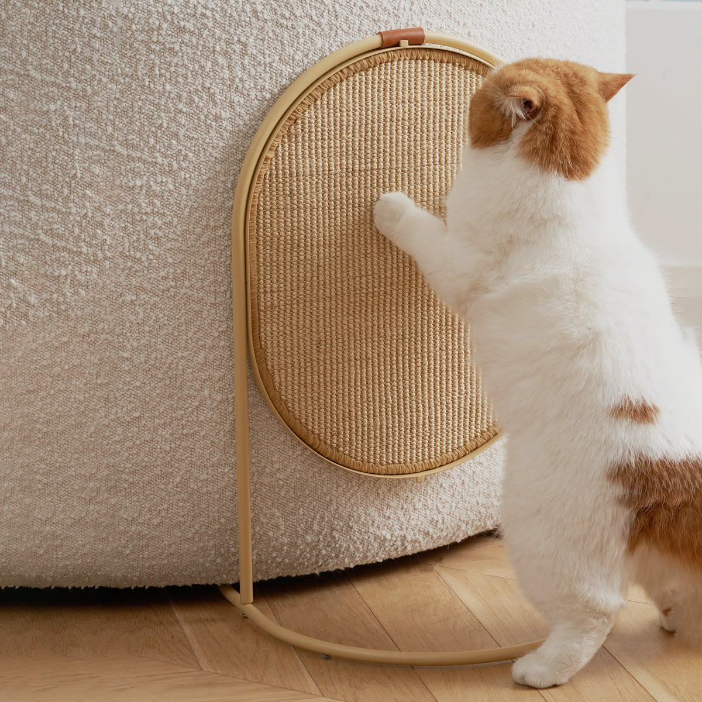
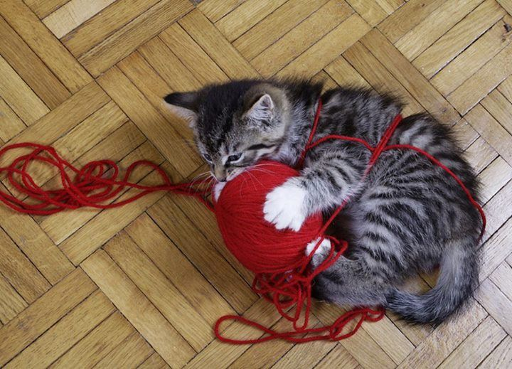
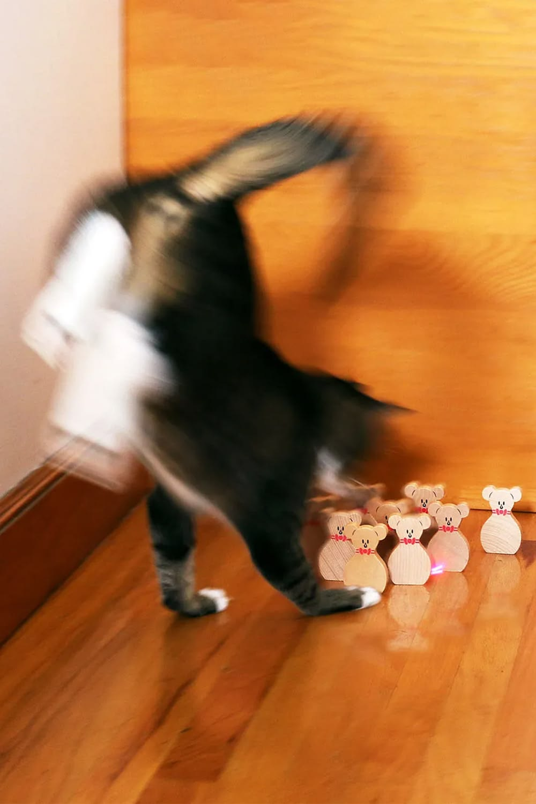
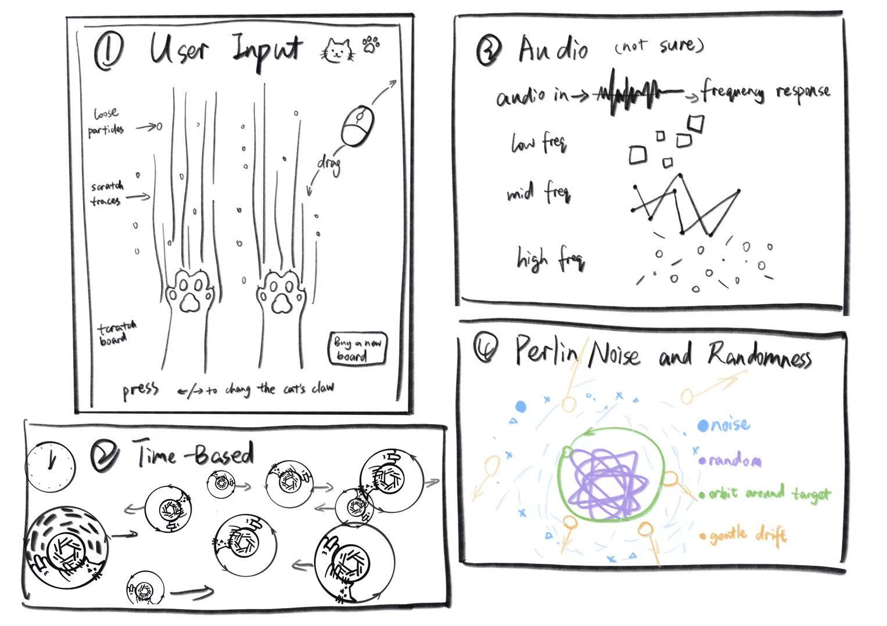

# Team-4_9103_tut1
xche0262/fali0101/wjia0677

IDEA9103 – Quiz 9

*Our team has chosen to create an original piece.*

# Option 1: Signal Trace Field

---

## Part 1: Project Direction

### Project Vision

Signal Trace Field is a relaxing mini-game that turns cat entertainment behaviours, such as scratching a board, tapping with paws, chasing light dots, chasing small balls, and orbiting moving toys, into an abstract visual field. The piece is inspired by scratch-board textures, paw marks, toy balls, and cats’ natural attention to moving objects. These behaviours become visual logic: paw movement becomes falling scratch traces, moving toys become timed target circles, and playful uncertainty becomes wandering paths. The canvas is built from circles, panels, particles, lines, and gentle motion. Users move the mouse, drag, press keys, or release input to create temporary marks, while background panels and drifting paths continue to shift calmly.

### Inspiration Images

1. Cat scratch-board behaviour: paw movement, vertical scratching, repeated texture.  
   

2. Chasing yarn balls: circular targets, stop-and-go movement. 
   

3. Chasing light dots: moving targets, sudden direction changes, playful attention.  
   

---

## Part 2: Mechanics

### Team Members and Ownership

| Team Member | Mechanic |
|---|---|
| Fanfei Li | User input |
| Sylvie Chen | Time-based + Audio |
| Wenjia Jiang | Perlin noise and randomness |
| All members | Audio |
---

### Mechanic 1 - User Input: Scratch Pad Paw Traces

This mechanic is inspired by a cat using a scratch board. The lower part of the canvas works as a soft scratch-pad area, and an abstract paw shape follows the mouse with slight delay. When the user presses or drags on the pad, thin vertical scratch lines appear under the paw, like marks left on cardboard or sisal. When the mouse is released, loose particles fall from the scratched area like small fibres or dust. Keyboard input can trigger stronger scratch bursts, so each action leaves a slightly different trace. The particles are stored in arrays, with varied size, speed, opacity, and drift. This mechanic connects to the project vision by turning pawing and scratching into temporary visual feedback. It gives the user a simple and playful action without complex rules.

Sketch: scratch pad area, paw shape, falling scratch lines, loose particles

---

### Mechanic 2 - Time-based: Moving Toy Panels

This mechanic is inspired by cats chasing yarn balls or small moving toys. It uses timers, frameCount, and repeated events to control the background layer. The canvas is divided into framed panels, where circles, rectangles, line groups, and soft colour blocks slowly scale, fade, slide, or pulse. Every few seconds, a small target circle changes position, size, or direction, like a toy that briefly catches the cat’s attention. frameCount keeps these changes smooth rather than sudden. This mechanic provides a calm rhythm behind the paw traces and wandering lines. It also keeps the piece alive when no one is interacting, because the targets continue to move, pause, and reappear across the field.

Sketch: framed panels, pulsing circles, moving yarn balls, sliding rectangles

---

### Mechanic 3 - Audio: Toy Sound Pulse

This mechanic uses the level or frequency content of an audio track to drive subtle visual changes. The sound can be based on a soft bell, toy sound, or gentle rhythmic audio that suggests cat play. Low frequencies can enlarge background circles slightly, mid frequencies can affect the thickness or speed of drifting lines, and higher frequencies can trigger small flickering particles near the target areas. As the sound changes, the canvas responds with calm pulses instead of dramatic effects. This connects to the project vision by giving the abstract field a hidden playful rhythm. The mechanic makes the space feel more alive, as if the visual system is quietly reacting to toys, motion, and attention.

Sketch: audio pulse, responsive circles, flickering particles

---

### Mechanic 4 - Perlin Noise and Randomness: Wandering Chase Lines

This mechanic uses Perlin noise and random values to create wandering paths, orbit-like trails, and moving dots. Random values decide where a path starts, how thick it is, how many segments it has, and how large nearby dots become. Perlin noise controls direction changes, so the movement feels smooth and organic rather than messy. Some lines can tangle inside one panel, some can loop around circles, and some can drift between panels. This connects to the project vision by translating the uncertain movement of playful chasing into abstract paths. The system suggests that small targets are being tracked, missed, and followed again. It keeps the field active while staying soft, loose, and visually controlled.

Skech: tangled paths, circular orbits, drifting dots, random-size balls

---

## Part 3: Putting It Together

The project uses one shared canvas with four connected layers. Time-based panels build the slow structure, audio adds gentle pulses, Perlin paths create wandering motion, and user input places paw traces on top. These systems influence each other lightly: target circles guide movement, drifting lines gather near active areas, and fresh scratch marks interrupt the field. Repeated circles, paw traces, particles, panels, and soft motion hold the whole piece together.

# Option 2: Emotion Garden

## Part 1: Project Direction

Our team will create an **original interactive piece**.

Emotion Garden explores how emotional states can be externalised through a generative visual system. It creates a calm and reflective space where users express emotions through growth, movement, colour, and decay.

The project is inspired by interactive installations that translate internal states into visual environments. teamLab’s works demonstrate how digital elements respond organically to human presence, while Rafael Lozano-Hemmer’s *Pulse Room* shows how invisible internal states can be visualised.

Emotion Garden applies these ideas by allowing emotions to be experienced through dynamic visual change rather than explicit labels.

## Inspiration

Link: https://www.teamlab.art/w/ffgarden/

Link: https://www.teamlab.art/w/koi_and_people/

Link: https://www.lozano-hemmer.com/pulse_room.php

## Part 2: Mechanics

| Team Member | Mechanic |
|---|---|
| Fanfei Li | User input |
| Sylvie Chen | Time-based + Audio |
| Wenjia Jiang | Perlin noise and randomness |
| All members | Audio |

### 1. Time-based Mechanic

Controls the lifecycle of flowers, including growth, bloom, and decay over time.

Users do not directly control this process. Instead, it unfolds continuously, reflecting how emotions evolve and creating a calm visual rhythm.

### 2. Perlin Noise and Randomness Mechanic

Uses Perlin noise and randomness to generate organic motion and variation.

It affects movement, shape, and distribution. Different moods modify these parameters, producing smooth or chaotic behaviour.

### 3. User Input Mechanic

Users select mood (1–4) and colour (R–P) through keyboard input.

Mood defines system behaviour, while colour defines visual expression. Feedback is communicated through flower generation and environmental change.

### 4. Audio Mechanic

Uses microphone input to influence system intensity.

Louder sound increases movement and activity, while quieter input produces calmer visuals.

## Part 3: Putting It Together

The system combines all four mechanics into a single environment.

User input defines mood and colour. Time-based processes control lifecycle. Perlin noise shapes motion, and audio input adjusts intensity.

Together, they create a continuously evolving visual system that supports emotional reflection through organic movement and change.

---
# Reference
1. https://www.pinterest.com/pin/475200198199229225/
2. https://it.pinterest.com/pin/308637380689329863/
3. https://it.pinterest.com/pin/183662491065977781/
